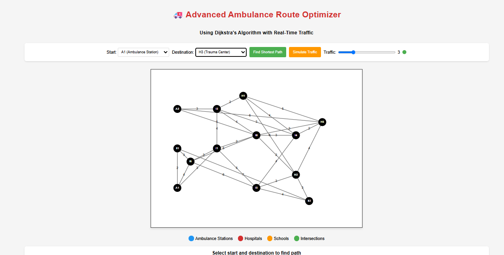
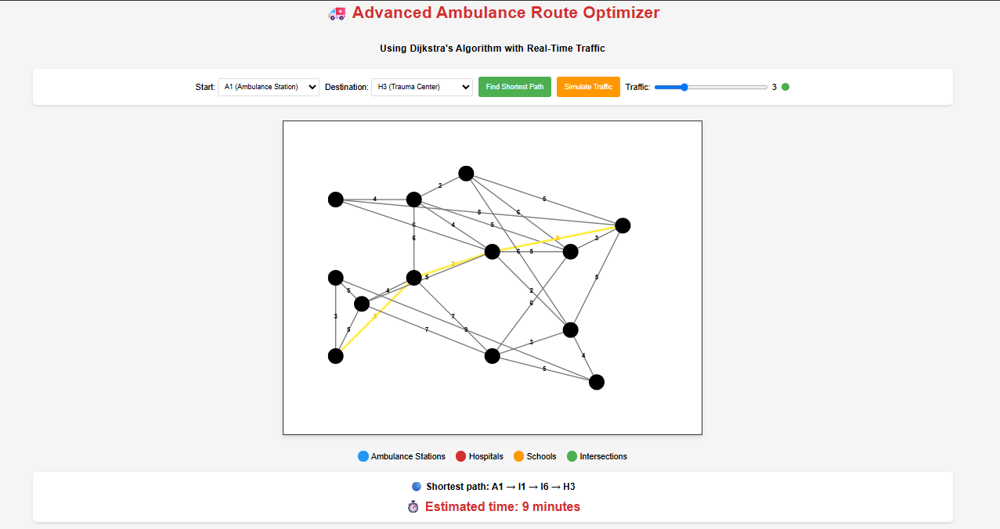

# Advanced Ambulance Route Optimizer Using Dijkstra's Algorithm

🚑 Advanced Ambulance Route Optimizer Using Dijkstra's Algorithm with Real-Time Traffic Simulation

## 📌 Overview

A web-based visualization tool that calculates the shortest path for ambulances using Dijkstra's algorithm, with dynamic traffic simulation to mimic real-world conditions.

## Key Features

🗺️ Interactive graph visualization of hospitals and routes  
⏱️ Real-time path calculation with time estimates  
🚦 Traffic simulation with adjustable intensity  
🏥 Hospital nodes highlighted for quick identification

## 🛠️ Technologies Used

**Frontend:** HTML5, CSS3, JavaScript (Vanilla JS)  
**Algorithms:** Dijkstra's shortest path (Priority Queue implementation)  
**Visualization:** SVG dynamic rendering

## 🚀 How to Run

**Clone the repository:**

```bash
git clone https://github.com/SAYOUNCDR/Route-Optimizer.git
```

**Open the project:**
Navigate to the project folder and open `index.html` in any modern browser (Chrome/Firefox/Edge).

## 🖥️ Usage Guide

**Select Nodes:**
Choose a start node (e.g., "A" for Ambulance) and destination node (e.g., "H1" for Hospital 1).

**Find Shortest Path:**
Click "Find Shortest Path" to highlight the optimal route in yellow.

**Simulate Traffic:**
Adjust the traffic slider (1-10) and click "Simulate Traffic" to dynamically update edge weights. Recalculate the path to see traffic-adjusted results.

## 📊 Graph Structure

```mermaid
graph LR
    A1 -->|2| S1
    A1 -->|4| I5
    A2 -->|3| I2
    A2 -->|5| I6
    A2 -->|6| H3
    H1 -->|6| H2
```

## 📂 Project Structure

```
ambulance-route-optimizer/
├── index.html          # Main HTML file
└── README.md           # This documentation
```

## 📁 Images




## 🤝 Contributing

Contributions are welcome! Open an issue or submit a PR for:

🐛 Bug fixes  
🚀 Performance optimizations  
🌟 New features (e.g., A\* algorithm, live traffic API integration)

## License

This project is open source and available under the MIT License.
